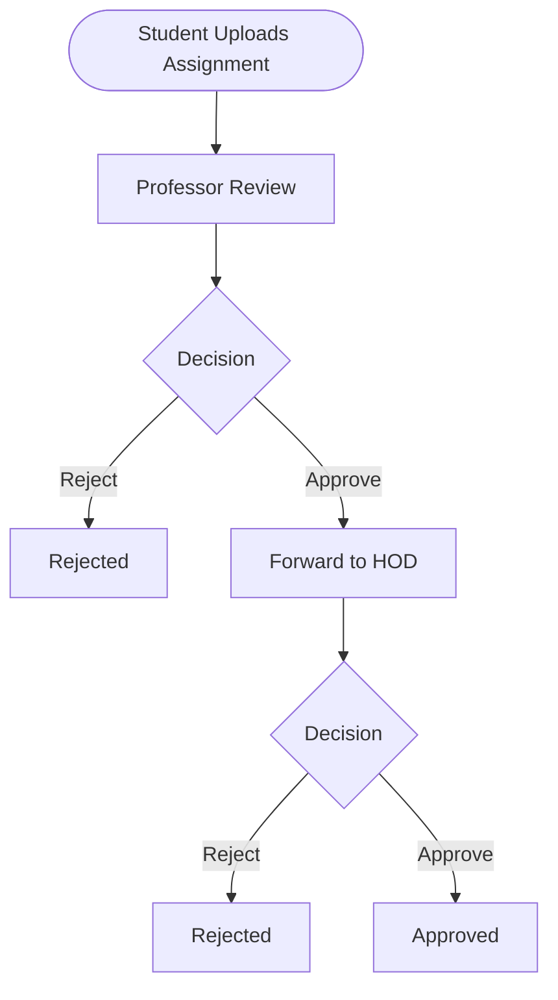
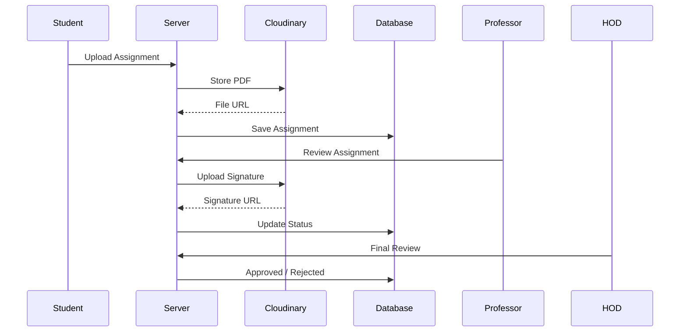
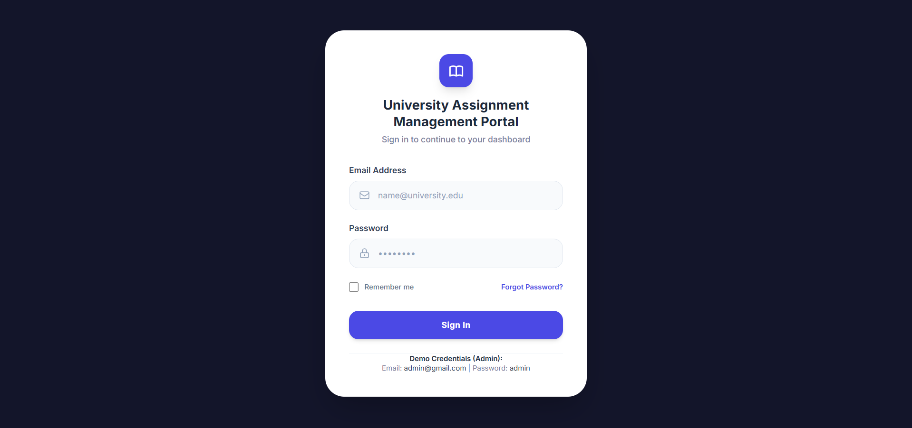
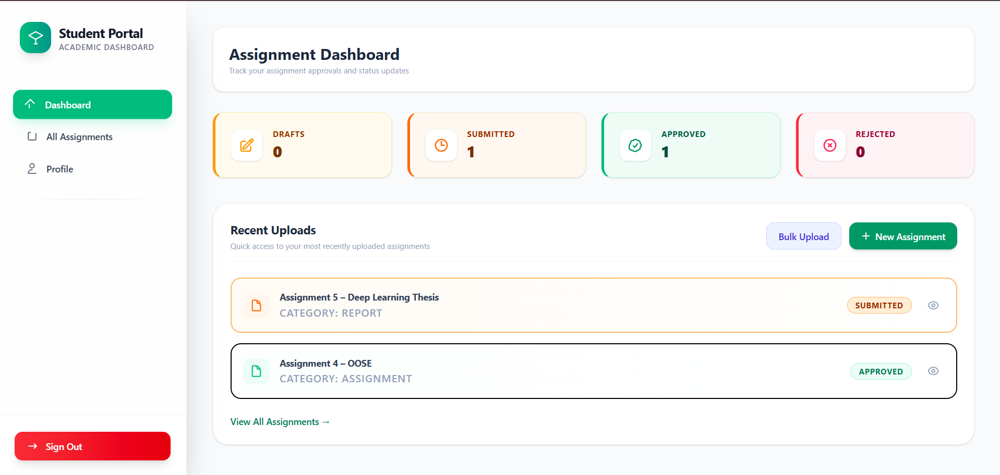
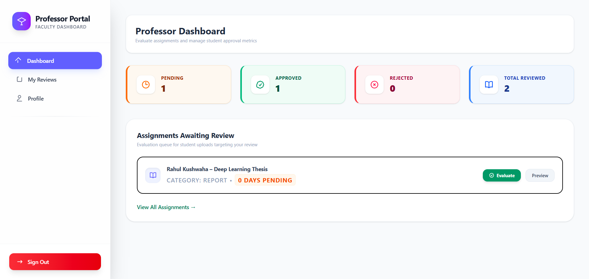
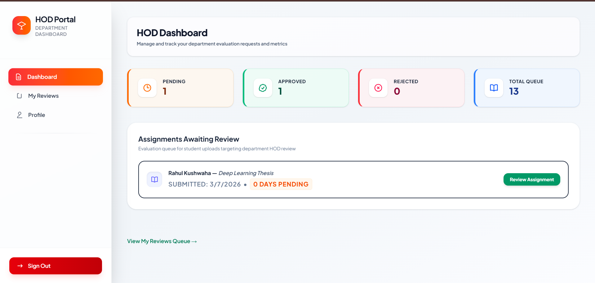
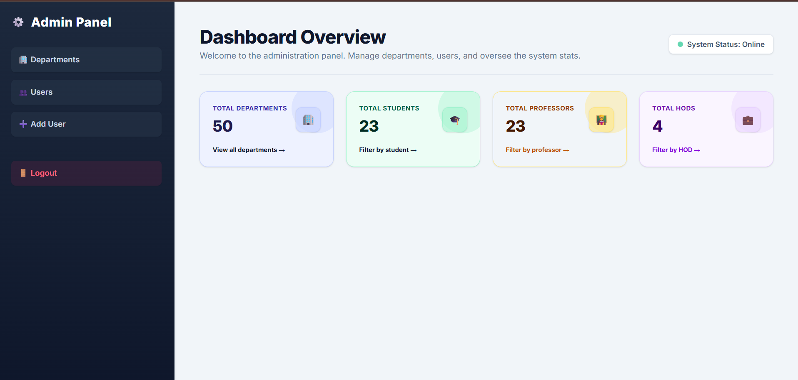

<p align="center">
  
</p>

<h1 align="center">🎓 University Assignment Management Portal</h1>

<p align="center">
A secure, role-based workflow management system for handling university assignment, report, and thesis submissions with multi-level approvals, digital signatures, cloud storage, and automated email notifications.
</p>


---

# 📖 Overview

The **University Assignment Management Portal** is a complete web-based workflow system that digitizes the academic submission and approval process within a university.

The application enables students to upload assignments, reports, and theses while allowing professors and department HODs to review, approve, or reject submissions using digital signatures. All uploaded files are securely stored on Cloudinary, and users receive automated email notifications throughout the workflow.

---

# ✨ Features

## 👨‍🎓 Student

- Secure Login
- Upload Assignment PDFs
- Upload Reports
- Upload Thesis Documents
- Bulk PDF Upload
- Track Submission Status
- View Approval History
- Dashboard Analytics

---

## 👨‍🏫 Professor

- View Pending Assignments
- Review Student Submission
- Preview Uploaded PDFs
- Approve / Reject Assignments
- Mandatory Digital Signature Validation
- Forward Approved Assignment to HOD
- Dashboard Statistics

---

## 👨‍💼 HOD

- Review Department Assignments
- Final Approval / Rejection
- Mandatory Signature Upload
- Department Queue
- Dashboard Analytics

---

## 👨‍💻 Admin

- Manage Departments
- Add/Edit/Delete Users
- Assign User Roles
- Manage Students
- Manage Professors
- Manage HODs

---

# 🚀 Key Features

- Role-Based Authentication
- JWT Authentication
- OTP Email Verification
- Password Encryption
- Assignment Workflow Automation
- Multi-Level Approval System
- Digital Signature Verification
- Cloudinary File Storage
- Email Notifications
- Department Management
- Dashboard Analytics
- Secure File Upload
- PDF Preview
- Responsive Interface

---

# 🛠 Technology Stack

| Technology | Description |
|------------|-------------|
| Node.js | Backend Runtime |
| Express.js | Web Framework |
| MongoDB | Database |
| Mongoose | ODM |
| HTML5 | Frontend |
| CSS3 | Styling |
| EJS | Templating Engine |
| Cloudinary | File Storage |
| Multer | File Upload Middleware |
| JWT | Authentication |
| Brevo API | Email Service |
| Nodemon | Development Server |

---

# 📂 Project Structure

```text
University-Assignment-Portal

│
├── config/
├── controllers/
├── middleware/
├── model/
├── public/
│   ├── css/
│   ├── images/
│   └── js/
│
├── routes/
├── uploads/
├── utils/
│
├── views/
│   ├── admin/
│   ├── student/
│   ├── professor/
│   └── hod/
│
├── server.js
├── package.json
└── README.md
```

---

# ⚙️ Installation

## Clone Repository

```bash
git clone https://github.com/yourusername/university-assignment-management-portal.git

cd university-assignment-management-portal
```

---

## Install Dependencies

```bash
npm install
```

---

## Configure Environment Variables

Create a `.env` file.

```env
PORT=3000

MONGODB_URI=your_mongodb_connection_string

JWT_SECRET=your_secret_key

CLOUDINARY_CLOUD_NAME=your_cloudinary_name

CLOUDINARY_API_KEY=your_cloudinary_api_key

CLOUDINARY_API_SECRET=your_cloudinary_api_secret

BREVO_API_KEY=your_brevo_api_key

SENDER_EMAIL=your_verified_sender_email
```

---

## Run Project

Development

```bash
npm run start
```

Production

```bash
node server.js
```

Server starts at

```
http://localhost:3000
```

---

# 🔑 Demo Credentials

## Admin

```
Email:
admin@gmail.com

Password:
admin
```

---

# 👥 User Workflow

```
Student
     │
     ▼
Upload Assignment
     │
     ▼
Professor Review
     │
 ┌───┴────────────┐
 │                │
Reject         Approve
 │                │
 ▼                ▼
End          Forward to HOD
                  │
                  ▼
             HOD Review
          ┌──────┴──────┐
          │             │
      Reject        Approve
          │             │
          ▼             ▼
   End Rejected   End Approved
```

---

# 📊 Workflow Process Flowchart



---

# 📈 End-to-End Sequence Diagram



---

# 📸 Application Screenshots

<table>
<tr>
<td align="center">
<b>🔐 Login</b><br>

</td>

<td align="center">
<b>👨‍🎓 Student Dashboard</b><br>

</td>
</tr>

<tr>
<td align="center">
<b>👨‍🏫 Professor Dashboard</b><br>

</td>

<td align="center">
<b>👨‍💼 HOD Dashboard</b><br>

</td>
</tr>

<tr>
<td align="center" colspan="2">
<b>👨‍💻 Admin Dashboard</b><br>

</td>
</tr>
</table>

# 🔒 Security Features

- JWT Authentication
- Password Hashing
- Role-Based Authorization
- Protected Routes
- OTP Email Verification
- Secure File Upload Validation
- Cloudinary Secure URLs
- Signature Validation
- Server-Side Input Validation

---

# 🔮 Future Enhancements

- AI Plagiarism Detection
- PDF Annotation
- Digital Certificate Generation
- Student Comments
- Real-Time Notifications
- Mobile Application
- Multi-University Support
- Audit Logs
- Search & Filters
- Download Approval History

---


# ⭐ Support

If you found this project helpful, consider giving it a ⭐ on GitHub.

---
